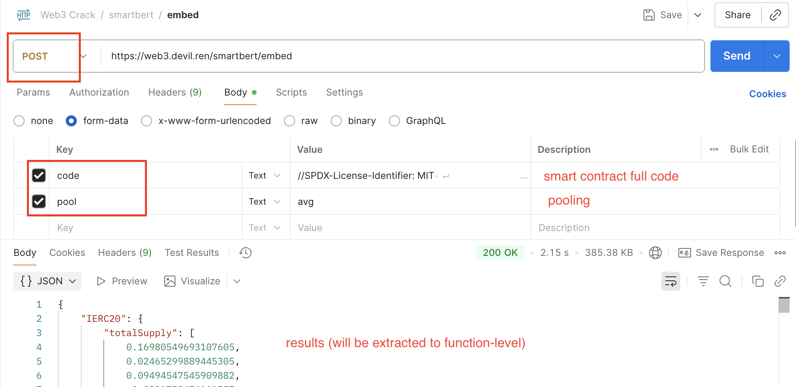
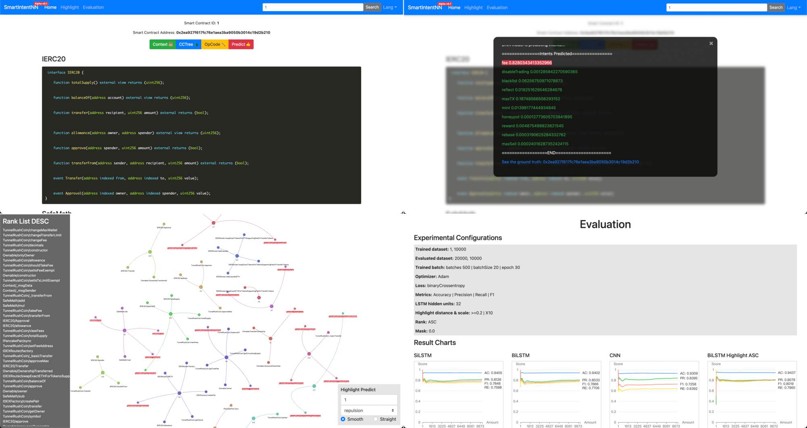

# Web3 Software Engineering Toolkit

🤩 We are building a comprehensive toolkit for **Software Engineering of Web3**.

The repo of **SmartIntentNN V2** is here: <https://github.com/web3se-lab/SmartIntent-py>

## Online

To try our research tools online, please visit the following website:

👉 <https://www.web3-se.com>

## Tookkit

**Tags: Web3, AI, Software Engineering**

-   🕸️ Web3 Data Crawler
-   🤔 Web3 Data Collection, Labelling, and Analysis
-   🚀 Build, Train, and Evaluate AI Models
-   👀 Data Visualization
-   🤝 Blockchain Network Interactions

### Project-1: SmartBERT



**Task:** Learn representations from smart contracts and provide a service for smart contract embedding.

**Link:** <https://github.com/web3se-lab/SmartBERT>

**Technical Points:**

-   Convert **smart contract** code context to vectors.
-   Built with **BERT/RoBERTa**-based pre-training models.
-   MLM-trained on **16,000+** (V2) real smart contracts.
-   Serving APIs: [tokenize](http://api.smart.cas-ll.cn/smartbert/tokenize), [embed](http://api.smart.cas-ll.cn/smartbert/embed), [code tree](http://api.smart.cas-ll.cn/smartbert/tree).

### Project-2: SmartIntentNN



🤩 **SmartIntentNN** is a deep neural network tool powered by [Tensorflow.js](https://github.com/tensorflow/tfjs).

**Task:** Build a deep learning model to detect developers' unsafe intents in smart contracts.

**Website:** <https://www.web3-se.com>

**Technical Guide:**

-   ⚙️ Frontend repository: <https://github.com/web3se-lab/web3-sekit-vue>
-   📱 Pages for testing the model online: [Detect](https://www.web3-se.com/), [Highlight](https://www.web3-se.com/highlight/), [Evaluate](https://www.web3-se.com/evaluate/)
-   🕵️ Click **"Detect My Smart Contract"** to copy and detect your customized smart contract.
-   🚀 Click **"Predict 🚀"** to detect the malicious intents in smart contracts.
-   🌲 Click **"CCTree 🌲"** to view the smart contract code tree.

**Technical Points:**

-   SmartIntentNN V1.0 is trained and evaluated on **Tensorflow.js**.
-   SmartIntentNN V1.0 employs a **Universal Sentence Encoder** to generate smart contract embeddings.
-   The intent highlight model is trained using **K-means clustering**.
-   SmartIntentNN V2.0 will integrate **SmartBERT** to embed smart contracts.
-   SmartIntentNN V2.0 is currently under writing. Stay tuned! (Maybe meet in ICSE2026).

## Dataset

We have compiled a comprehensive dataset of **vulnerabilities** and **intents** in smart contracts!

**💽 Access Our Dataset via this API: <https://api.smart.cas-ll.cn>**

The URL above offers a `GET/POST JSON` API.

You can query data by modifying the `key` parameter in the URL.

Please refer to the guidelines below:

### Smart Contract Intent

<https://api.smart.cas-ll.cn/data/intent?key=1>

Please iterate over keys: `1, 2, 3, ...`. If an error occurs, skip that key and continue (key++, continue).

Ground truth label distribution for Intent data:

| Intent Type    | Explanation                                                                                                      | Num   |
| -------------- | ---------------------------------------------------------------------------------------------------------------- | ----- |
| Fee            | Arbitrarily changes transaction fees, transferring them to specified wallet addresses.                           | 33268 |
| DisableTrading | Enables or disables trading actions on a smart contract.                                                         | 6617  |
| Blacklist      | Restricts designated users' activities, potentially infringing on fair trade rights.                             | 4729  |
| Reflection     | Redistributes taxes from transactions to holders based on their holdings, attracting users to buy native tokens. | 46452 |
| MaxTX          | Limits the maximum number or volume of transactions.                                                             | 17043 |
| Mint           | Issues new tokens, either unlimited or controlled.                                                               | 10572 |
| Honeypot       | Traps user-provided funds under the guise of leaking funds.                                                      | 290   |
| Reward         | Rewards users with crypto assets to encourage token use, despite possible lack of value.                         | 4178  |
| Rebase         | Adjusts token supply algorithmically to control price.                                                           | 659   |
| MaxSell        | Limits specified users' selling times or amounts to lock liquidity.                                              | 68    |

### Smart Contract Vulnerability

<https://api.smart.cas-ll.cn/data/vulnerability?key=1>

Please iterate over keys: `1, 2, 3, ...`. If an error occurs, skip that key and continue (key++, continue).

Ground truth label distribution for Vulnerability data:

| Vulnerability Type           | Num |
| ---------------------------- | --- |
| block number dependency (BN) | 116 |
| timestamp dependency (TP)    | 214 |
| dangerous delegatecall (DE)  | 48  |
| ether frozen (EF)            | 57  |
| ether strict equality (SE)   | 45  |
| integer overflow (OF)        | 23  |
| reentrancy (RE)              | 103 |
| unchecked external call (UC) | 113 |

### Models

🤖 Acces **SmartIntentNN V1.0** models: <https://github.com/web3se-lab/web3-sekit-vue/releases/tag/V1>

-   Download `v1.zip`, then unzip and move them to `/tf/models/v1/`.
-   For **Universal Sentence Encoder**, download <https://tfhub.dev/google/universal-sentence-encoder/4>, then move it to `/tf/models/` and rename the dir as `universal-sentence-encoder`.
-   For **K-means intent highlight model**, download `kmeans-model.json`, then move it to `/tf/models/kmeans-model.json`.

The structure of directory should be like the following figure:


How to run these models in Tensorflow.js?

-   To predict: `node tf/v1/use-high-bilstm-x2.js predict 1`
-   To evaluate: `node tf/v1/use-high-bilstm-x2.js evaluate`
-   To train: `node tf/v1/use-high-bilstm-x2.js train`
-   To summary: `node tf/v1/use-high-bilstm-x2.js summary`

### Training & Evaluating Settings

See settings in `/tf/v1/model.js`.

The following is the setup of SmartIntentNN (V1).

**Training**

Scope: 1, 10000
Batch: 200
Batch Size: 50
Epoch: 100

**Evaluating**

Scope: 20000, 10000

## Install

Before using this program, you will need to install **nodejs** and **npm** tools first, then you install dependencies.

Our recommended version is Node.js v16+.

```bash
yarn
# or
npm install
```

## Prepare

Prepare a csv dataset of smart contracts and put them in the directory `/db`.

For BSC Mainnet, download the latest verified contracts from [BSC verified contracts addresses](https://bscscan.com/exportData?type=open-source-contract-codes).

Then, you need to config your own _bscscan_, _etherscan_ [API](https://docs.bscscan.com/api-endpoints/contracts) secret keys in `/src/config/network.json`.

## Database

If you would like to set up a localhost database, we prepare a `docker-compose.yml` for you.

To start a MySQL docker service locally, try:

```bash
docker-compose -f ./docker/docker-compose.yml
```

To connect to local mysql database, you can create and modify the `.env` as the following content:

```
# DB
DB_DIALECT=mysql
MYSQL_HOST=localhost
MYSQL_USER=web3
MYSQL_PASS=web3
MYSQL_DB=web3

# SMARTBERT
EMBED_API=

# this service port
WEB_PORT=8081

# for CPU mode
TFJS=@tensorflow/tfjs-node
# for GPU mode
# TFJS=@tensorflow/tfjs-node-gpu
```

Then you can test your database connection and create the initial tables:

```bash

# test connect to databases
node ./db/DB.js test

# init tables, if table is not input, default is all the tables
node ./db/DB.js init [table_name]

# drop tables, be careful!
node ./db/DB.js drop [table_name]

```

We use [sequelize](https://sequelize.org/) to manage a database.

For the details of data structures, please refer to `db/Model.js`

To get the entire database backup, please contact us: **devilyouwei@foxmail.com**

## Web

**Serve Web APIs**

```bash
# development mode
yarn dev
# product mode
yarn start
# stop web service
yarn stop
```

**APIs for dataset**

-   [data/get](http://api.smart.cas-ll.cn/data/get)
-   [data/intent](http://api.smart.cas-ll.cn/data/intent)
-   [data/vulnerability](http://api.smart.cas-ll.cn/data/vulnerability)

**SmartBERT APIs**

-   [tokenize](http://api.smart.cas-ll.cn/smartbert/tokenize)
-   [embed](http://api.smart.cas-ll.cn/smartbert/embed)
-   [token/get](http://api.smart.cas-ll.cn/smartbert/tree)

**POST params**

1. `code` smart contract code content (Solidity)
2. `pool` pooling type: `avg`, `max`, `cls`

EXAMPLE: [embed](http://api.smart.cas-ll.cn/smartbert/embed) is used to convert smart contract code to embedding vectors:

```json
{
    "code": "input solidity code here",
    "pool": "avg"
}
```

## Paper

@article{huang2025smart,
  title={Smart Contract Intent Detection with Pre-trained Programming Language Model},
  author={Huang, Youwei and Li, Jianwen and Fang, Sen and Li, Yao and Yang, Peng and Hu, Bin and Zhang, Tao},
  journal={arXiv preprint arXiv:2508.20086},
  year={2025}
}

```tex
@inproceedings{huang2025deep,
  title={Deep smart contract intent detection},
  author={Huang, Youwei and Fang, Sen and Li, Jianwen and Hu, Bin and Tao, Jiachun and Zhang, Tao},
  booktitle={2025 IEEE International Conference on Software Analysis, Evolution and Reengineering (SANER)},
  pages={124--135},
  year={2025},
  organization={IEEE}
}
```

```tex
@article{huang2022smartintentnn,
  title={Smartintentnn: Towards smart contract intent detection},
  author={Huang, Youwei and Fang, Sen and Li, Jianwen and Hu, Bin and Zhang, Tao},
  journal={arXiv preprint arXiv:2211.13670},
  year={2022}
}
```

Continuously writing and updating...

## Resource

### DataSource

1. <https://bscscan.com>
2. <https://etherscan.io>
3. <https://tokensniffer.com>
4. <https://bscheck.eu>
5. <https://scamsniper.net>
6. <https://aphd.github.io/smart-corpus>
7. <https://dashboard.tenderly.co/explorer>
8. <https://tools.staysafu.org>
9. <https://github.com/Messi-Q/Smart-Contract-Dataset>

### Dependency

1. [TensorFlow.js](https://js.tensorflow.org/api/latest/)
2. [TensorFlow Hub](https://tfhub.dev/)
3. [Universal Sentence Encoder V4](https://tfhub.dev/google/universal-sentence-encoder/4)

## Contributors

- [Youwei Huang](https://www.devil.ren) – Project initiator, first author, and principal researcher  
- [Sen Fang](https://tomasandersonfang.github.io/) – Model development, paper review, and principal researcher (model)


## Acknowledgment

-   [Institute of Intelligent Computing Technology, Suzhou, CAS](http://iict.ac.cn/)
-   [Macau University of Science and Technology](http://www.must.edu.mo)
